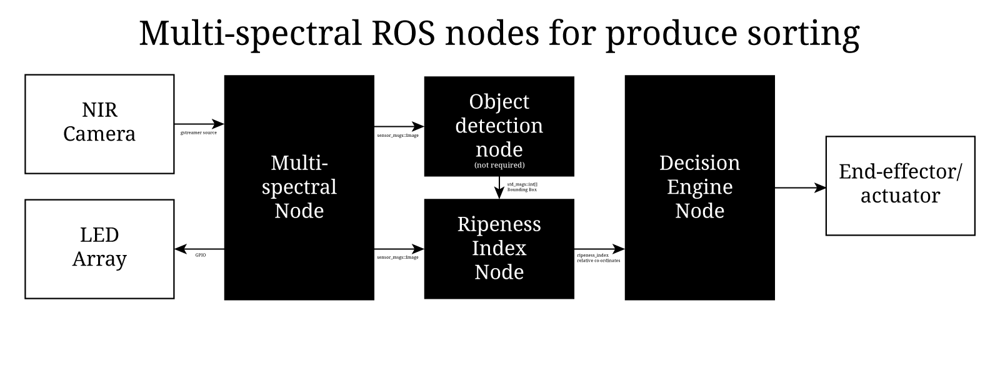
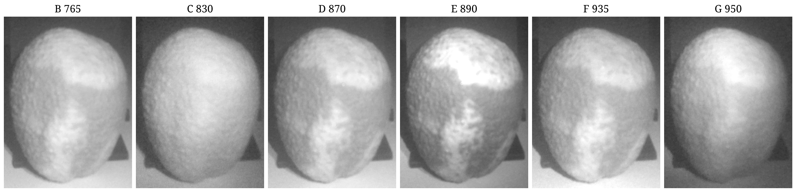

# War on Waste
An exploration of using open-source hardware &amp; software to democratize waste recycling and processing  

  

Each year humans collectively dump over 2 billion tons of waste and are on track to over 3.4 billion tons/ year by 2050. Currently this directly affects over 61 million people, and amounts to approximately 5% of greenhouse gas emissions.

Almost half of all wastage is food waste, of which 40% is wasted at retail and consumer levels due to an over-emphasis on appearance in quality standards. Despite such a large quantity of waste coming from food, only a small portion of this is composted (when food waste is placed in landfill it produces methane rather than CO2, see [compost vs landfill](https://recycle.com/organics-compost-vs-landfill/)). In addition many methods for up-cycling food wastage simply aren't implemented either due to increased cost of manual labor, or lack of adoption industry wide.

The evolution of single-stream recycling has resulted in increased recycling rates, as consumers don't have to do the sorting manually, and reduces cost for recycling plants (only one collection system). However, it has also lead to a decrease in the quality of materials recovered due to increased contamination from non-approved materials or unclean recyclables (it is generally to expensive for a recycling plant to clean recyclables) being placed in single stream bins.

Over the past few years with the rise of AI on the edge and IoT a number of new products have been in development to help combat the waste issue. Some of these include Alphabets X's Everyday Robot, Tomra's Container Deposit, and 'smart bins' that sort what goes into them. While these products are slowly to help combat some of these issues, adoption can be slow and costly.

This project will showcase some methodologies and processes for the development of a low-cost open-source waste management system, opening possibilities for democratizing the recycling industry. While this isn't an end-to-end project and demonstration (due to limitations in resources), it will discuss the components required in classifying waste types and proposed methodologies for dealing with them.

#### See the full write-up on [Hackster.io](https://www.hackster.io/jedhodson/automating-the-war-on-waste-eaffe2)